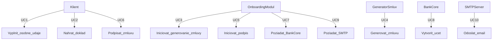

# Analýza modulu: Online založenie účtu

## 1. Kontext a účel
- **Cieľ:** Umožniť klientovi založiť účet plne online.
- **Hlavní aktéri:** Klient, Onboarding modul, GeneratorSmluv, BankCore, SMTP Server.

## 2. Tabulka aktérov

| Aktér                | Popis                                                 |
| -------------------- | ----------------------------------------------------- |
| **Klient**           | Nový zákazník pristupujúci k on­line formuláru.       |
| **Onboarding Modul** | Aplikačná logika, ktorá spracúva všetky kroky. Cieľový systém |
| **GeneratorSmluv**   | Externé REST API na generovanie + podpis zmlúv.       |
| **BankCore**         | Externé SOAP API na vytvorenie čísla účtu.            |
| **SMTP Server**      | Interný mail-server na odoslanie potvrdenia a zmluvy. |

## 3. Funkčné požiadavky
1. Vyplnenie osobných údajov
2. Nahratie dokladu totožnosti
3. Generovanie a podpis zmluvy
4. Vytvorenie účtu a zaslanie e-mailu

## 4. Use-Case diagram

