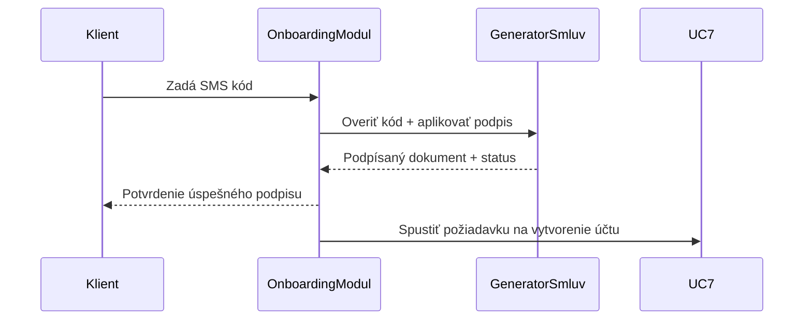

# UC6: Podpísať zmluvu

**Primárny aktér:** Klient  
**Sekundárny aktér:** OnboardingModul, GeneratorSmluv  
**Cieľ:** Klient zadá SMS podpisový kód a podpíše dokument generovaný v predchádzajúcich krokoch.

**Predpoklady:**  
- UC5 (Iniciovať podpis zmluvy) bol úspešne dokončený.  
- Klient obdržal SMS s podpisovým kódom.  
- Systém má pripravené rozhranie na zadanie kódu.

---

## Hlavný scenár

1. **Klient** sa nachádza v rozhraní na podpis zmluvy.  
2. Klient zadá podpisový SMS kód.  
3. **OnboardingModul** odošle tento kód do **GeneratorSmluv** cez REST API:
   - `POST /contracts/confirm-signature`
   - Body: `{ documentId, smsCode }`
4. **GeneratorSmluv**:
   - Overí správnosť SMS kódu
   - V prípade úspechu aplikuje podpis do PDF
   - Uloží podpísaný dokument
   - Vráti dokument a stav „signed“ späť do OnboardingModulu
5. **OnboardingModul** uloží podpísaný dokument do svojho úložiska a aktualizuje stav.  
6. Klientovi sa zobrazí potvrdenie „Zmluva bola úspešne podpísaná“.  
7. OnboardingModul pokračuje na UC7 (Požiadať BankCore o vytvorenie účtu).

---

## Alternatívne scenáre

- **2a. Klient zadá nesprávny SMS kód**  
  - OnboardingModul odošle kód do GeneratorSmluv  
  - GeneratorSmluv vráti chybu „invalid_code“  
  - Klientovi sa zobrazí „Zadaný kód nie je platný, skúste znova.“  
  - Po 3 neúspešných pokusoch sa podpis zablokuje a je potrebné opätovne inicializovať podpis (UC5)

- **3a. GeneratorSmluv nedostupný alebo vráti technickú chybu**  
  - OnboardingModul zobrazí hlášku „Chyba na strane podpisovej služby, skúste neskôr.“  
  - Klient môže zopakovať zadanie kódu alebo ukončiť proces

- **4a. Podpis zlyhá pri aplikovaní do PDF**  
  - GeneratorSmluv vráti stav „signing_failed“  
  - OnboardingModul zaznamená chybu, zobrazí klientovi hlášku „Nepodarilo sa podpísať zmluvu. Kontaktujte podporu.“  

---

## Mermaid diagram

## Poznámky
 - Tento UC pokrýva samotný podpis a validáciu podpisového kódu.
 - Bezpečnostný limit 3 pokusov je definovaný na strane OnboardingModulu.
 - V prípade opakovania procesu sa musí znovu spustiť UC5.

