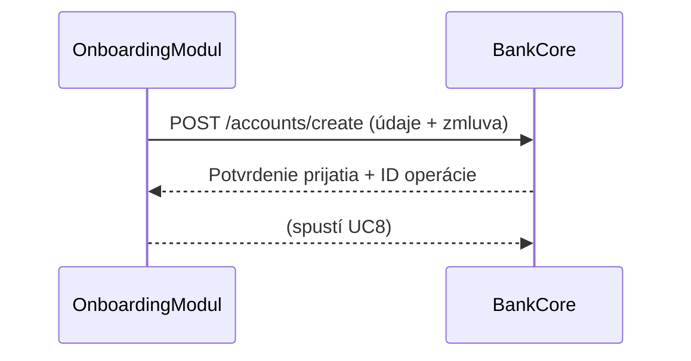

# UC7: Požiadať BankCore o vytvorenie účtu

**Primárny aktér:** OnboardingModul  
**Sekundárny aktér:** BankCore  
**Cieľ:** Odoslať požiadavku s údajmi klienta na vytvorenie bankového účtu.

**Predpoklady:**  
- UC6 (Podpísať zmluvu) bol úspešne dokončený.  
- Klient má v systéme všetky potrebné údaje a podpísaný dokument.  

---

## Hlavný scenár

1. **OnboardingModul** zostaví požiadavku pre vytvorenie účtu:
   - Identifikátor klienta
   - Osobné údaje (meno, RČ, adresa...)
   - Typ účtu
   - Referencia na podpísanú zmluvu
2. OnboardingModul odošle požiadavku cez REST API na **BankCore**:
   - `POST /accounts/create`
   - Body: `{ clientData, agreementRef }`
3. Po úspešnom prijatí požiadavky BankCore vráti späť stav „prijaté“, prípadne číslo ticketu / ID operácie.
4. OnboardingModul uloží ID operácie a stav „čaká na vytvorenie účtu“.
5. UC8 sa následne vykoná v BankCore (asynchrónne alebo synchrónne podľa integrácie).

---

## Alternatívne scenáre

- **2a. Chyba pri komunikácii s BankCore**  
  - Timeout, HTTP 5xx alebo sieťová chyba  
  - OnboardingModul zaznamená chybu, prepne stav procesu na „technický problém“  
  - Zobrazí klientovi správu: „Vytvorenie účtu dočasne nedostupné, skúste neskôr.“

- **3a. Validácia zlyhá**  
  - BankCore vráti HTTP 400 s detailom chýb  
  - OnboardingModul upozorní operátora na chybu a pozastaví vytvorenie účtu  

---

## Mermaid diagram

